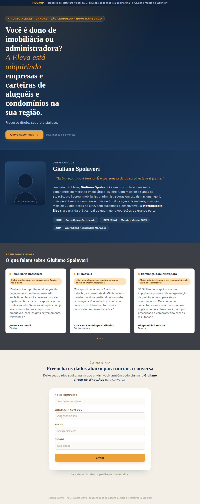

# Proposta de Squeeze Page — Compra de Carteiras Imobiliárias
**RECRIA Marketing, 23/09/2026**
**Cliente:** Eleva

## Contexto

Os primeiros 5 dias da campanha "AM | Eleva - Compra de Carteiras Imobiliárias" mostraram que levar o clique direto para o WhatsApp não filtra quem realmente é dono ou decisor de imobiliária/administradora. A proposta abaixo é uma squeeze page de qualificação antes de liberar o WhatsApp, mantendo o mesmo padrão visual que a Eleva já usa no site (seção de autoridade e carrossel de provas sociais já existentes, só reaproveitados aqui).

## Mockup da página

*Mockup de referência visual, o Giuliano monta a versão final direto no Webflow usando o prompt abaixo.*

## Prompt para o Giuliano criar a LP no Webflow (squeeze page)

**Objetivo da página:** captar lead qualificado (dono/decisor de imobiliária ou administradora) antes de liberar o contato direto no WhatsApp, filtrando curiosos e gente fora do perfil.

**Seção 1 — Confirma a promessa do criativo**

Tag: "Porto Alegre, Canoas, São Leopoldo e Novo Hamburgo"

Headline: "Você é dono de imobiliária ou administradora? A Eleva está adquirindo empresas e carteiras de aluguéis e condomínios na sua região."

Subheadline: "Processo direto, seguro e sigiloso."

Botão: "Quero saber mais" (âncora rolando para o formulário, seção 4)

**Seção 2 — Quem está por trás, autoridade do Giuliano**

Reaproveitar a seção de autoridade que já existe no site (foto, citação "Estratégia não é teoria. É experiência de quem já esteve à frente.", bio com +35 anos de atuação, +2,2 mil condomínios geridos, +8 mil locações de imóveis, +20 M&A concluídos, Metodologia Eleva, e os badges IBGC, IREM e ARM). É só copiar a estrutura que já está pronta e ajustar para esta squeeze page.

**Seção 3 — Provas sociais (carrossel já existente)**

Reaproveitar o carrossel de depoimentos/cases que já existe no site, mesma estrutura de card com selo, citação e assinatura.

**Seção 4 — Formulário com liberação do WhatsApp**

Headline: "Preencha os dados abaixo para iniciar a conversa"

Texto de apoio (antes do formulário): "Deixe seus dados aqui e, assim que enviar, você também pode chamar o Giuliano direto no WhatsApp para conversar."

Campos: Nome completo, WhatsApp com DDD, E-mail, Cidade

Depois de enviar: "Obrigado! Agora é só chamar o Giuliano." + botão "Falar agora no WhatsApp com Giuliano", pré-preenchido com uma mensagem já contextualizada (ex: "Olá Giuliano, preenchi o formulário sobre a compra de carteira imobiliária").

## Sugestão de carrossel (anúncio, 5 slides)

1. "Você é dono de imobiliária ou administradora?"
2. "A Eleva está adquirindo empresas e carteiras de aluguéis e condomínios"
3. "Negociação direta com Giuliano Spolavori, +35 anos de mercado, +2.200 condomínios geridos"
4. "Processo seguro e sigiloso, sem expor sua empresa no mercado"
5. "Toque para saber como funciona" (CTA)

## Roteiro de vídeo curto (até 2 min) para o Giuliano gravar

**Gancho + proposta (0-25s):** "Se você é dono de imobiliária ou administradora em Porto Alegre, Canoas, São Leopoldo ou Novo Hamburgo, eu tenho uma proposta para te fazer. Estamos adquirindo empresas e carteiras de aluguéis e condomínios na sua região. Se você está pensando em vender sua carteira ou sua empresa, você vai negociar diretamente comigo, fundador da Eleva."

**Credenciais (25-60s):** "Eu sou Giuliano Spolavori, tenho mais de 35 anos no mercado imobiliário, já geri mais de 2.200 condomínios, já conduzi mais de 20 operações de M&A no setor."

**Prova/confiança (60-90s):** "Já são mais de 8 mil imóveis locados sob gestão através das operações que eu conduzi. Então, você está falando com alguém que entende exatamente o valor do que você construiu."

**CTA (90-110s):** "Se interessou, quer negociar comigo? Então, toque no botão para saber mais."
