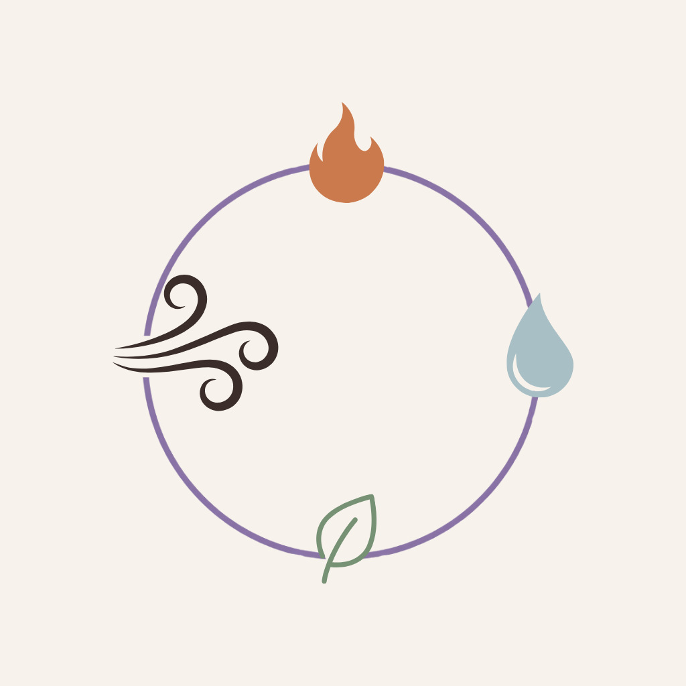
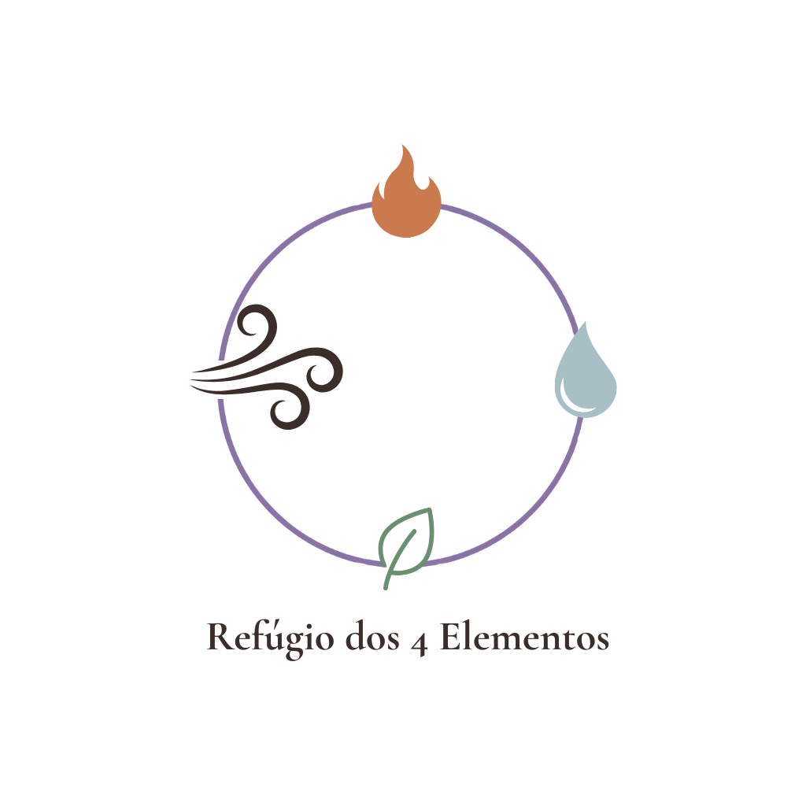
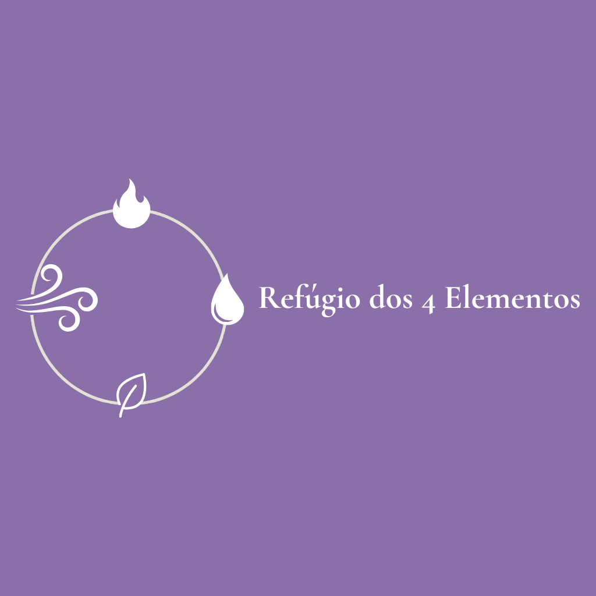
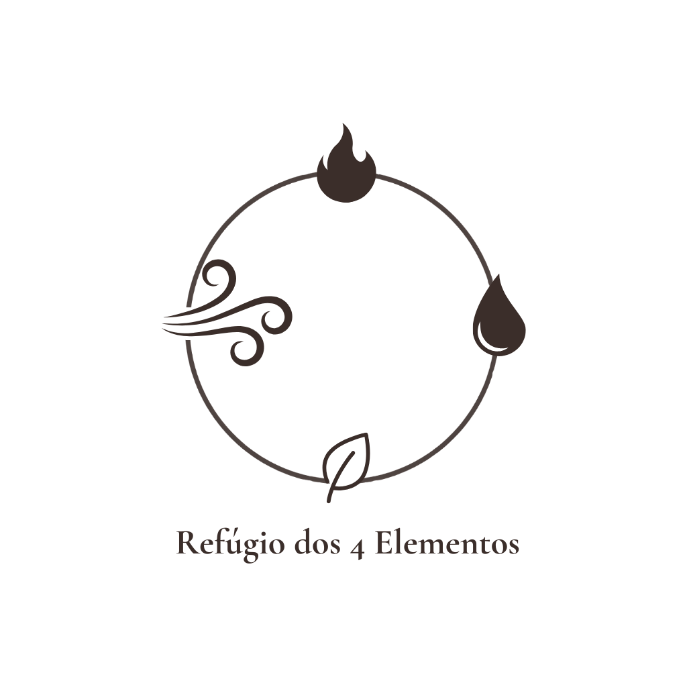
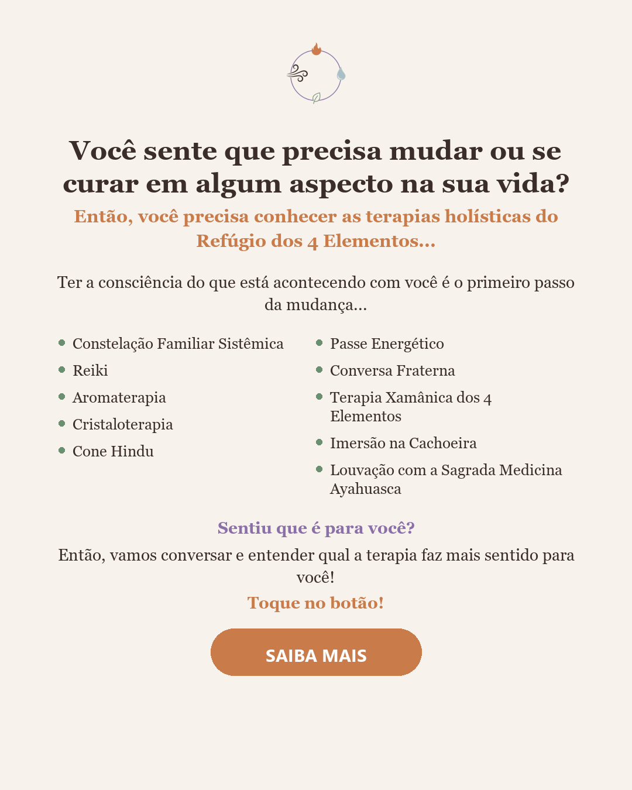
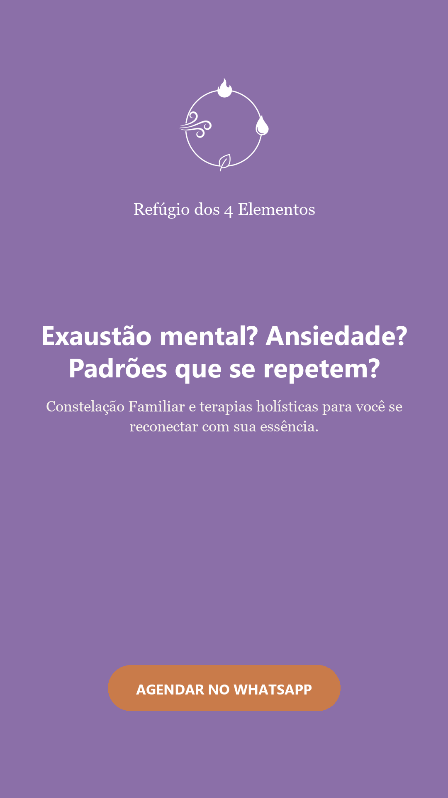
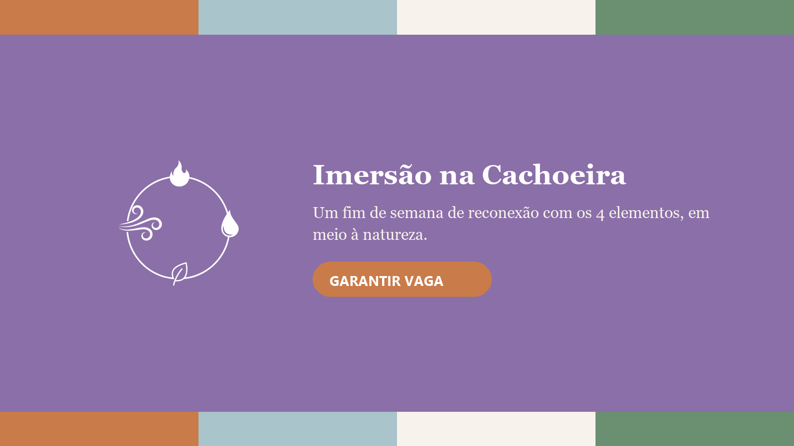

# Manual de Identidade Visual — Refúgio dos 4 Elementos
**RECRIA Marketing • 22/06/2026**
**Tipo:** Branding (identidade nova) — cliente não possuía identidade visual formalizada

## 1. Essência da Marca

**Missão:** Oferecer um espaço seguro de acolhimento e cura, onde cada pessoa possa se reconectar com sua própria essência através da sabedoria dos 4 elementos da natureza (Terra, Água, Ar e Fogo) e de práticas terapêuticas, energéticas e espirituais conduzidas com escuta genuína e responsabilidade técnica.

**Visão:** Ser reconhecido como referência em terapia holística universalista — a primeira indicação de quem busca transformação real, acolhimento sem julgamento e segurança em práticas como Constelação Familiar, Reiki e Ayahuasca, atendendo online o Brasil todo e presencialmente Cuiabá e a região de MT.

**Valores:**
- **Acolhimento incondicional** — ninguém é obrigado a nada aqui; cada pessoa avança no seu próprio tempo, sem pressão.
- **Universalidade espiritual** — respeitamos todas as crenças; nenhuma prática é vinculada a uma religião específica.
- **Técnica com seriedade** — cada terapia é conduzida com responsabilidade e conhecimento real, não apenas boa intenção.
- **Conexão com a natureza** — Terra, Água, Ar e Fogo orientam tanto o cuidado terapêutico quanto a forma de se comunicar.
- **Transformação genuína** — buscamos resultado real na vida das pessoas, não promessas vazias ou cura instantânea.

## 2. Tom de Voz

**Como a marca fala:** Acolhedora e gentil, espiritual mas não dogmática, natural e orgânica, leve e com toques pontuais de bom humor — e, ao falar de técnica/método, assume um tom mais assertivo e seguro, sem perder a gentileza.
*Exemplo:* "Você não precisa estar pronto pra nada aqui — só precisa se permitir chegar."

**Como a marca NÃO fala:** Não fala de forma fria, clínica ou com jargão técnico não explicado. Não usa linguagem ou simbologia vinculada a uma religião específica. Não promete cura garantida, milagrosa ou em prazo fixo. Não usa tom de urgência agressiva de vendas ("últimas vagas!!!", contagem regressiva alarmista).

## 3. O que pode / o que não pode na comunicação

| Pode | Não pode |
|---|---|
| Falar na 2ª pessoa, em tom de conversa próxima e gentil | Usar jargão técnico-esotérico sem explicar em linguagem simples |
| Falar abertamente sobre exaustão, ansiedade, pânico, dependência, sem estigmatizar | Usar símbolos, termos ou referências de uma religião específica |
| Usar elementos visuais da natureza (folha, água, fogo, pedra, montanha) | Prometer "cura garantida" ou resultado em prazo fixo |
| Explicar o que é Constelação Familiar em linguagem leiga, reforçando que não tem vínculo religioso | Usar linguagem de urgência agressiva tipo caça-clique |
| Usar leveza e humor pontual mesmo em temas sérios | Usar imagens de banco de imagens genéricas que não pareçam o espaço real |
| Reconhecer a equipe de terapeutas/consteladores, não só uma pessoa | Centralizar toda a comunicação em uma única pessoa quando o atendimento é em equipe |

## 4. Logo — FECHADO

**Conceito (versão final aprovada):** Um anel fino e delicado (não um traço grosso) com o interior vazio — sem ponto central, sem linhas internas dividindo o círculo. Sobre a própria linha do anel, 4 ícones simples sentados como marcadores: chama (Fogo, terracota) no topo, gota (Água, azul acinzentado) à direita, folha com uma linha central (Terra, verde sálvia) na base, e vento — duas linhas curvas fluindo terminando em espiral (Ar, marrom) à esquerda. O nome "Refúgio dos 4 Elementos" usa Cormorant Garamond (ver seção 6). Logo desenvolvido com a usuária via iteração de prompt em IA generativa (Recraft Red Panda) e finalizado/montado no Canva.

**Arquivos finais** (salvos em `refugio-dos-4-elementos/LOGO_R_4_E_com_variações/` e `LOGO_R_4_E_com_variações_com_fundo/`):
- Símbolo isolado, colorido, fundo transparente e fundo creme — uso em foto de perfil do Instagram/WhatsApp Business, favicon
- Logo completo vertical (símbolo + nome), colorido — uso principal em site, materiais impressos
- Logo horizontal (símbolo + nome lado a lado), branco sobre fundo lilás — uso em banners e capas largas
- Versão monocromática (marrom `#3B2E2A` e branca) do símbolo e do logo completo — uso sobre fotos ou fundos onde a versão colorida perca contraste

**Aplicações fictícias de exemplo** geradas para validar legibilidade em contexto real: ver `aplicacoes-ficticias/` (post de Instagram, anúncio Stories/Reels, banner de Imersão na Cachoeira).

**Área de respiro mínima e tamanho mínimo:** Manter ao redor do logo um espaço livre equivalente à altura do símbolo. Em uso digital, não reduzir o logo completo a menos de 120px de largura, para não perder a legibilidade dos 4 ícones — o anel é fino por design, então tamanhos muito pequenos tendem a "sumir" o traço antes dos ícones.

## 5. Paleta de Cores (Canva)

A paleta combina as duas referências levantadas no diagnóstico — lilás (Daniela) e verde (Jean Carlos) — com o lilás como cor dominante (liga mais diretamente à mística/espiritualidade e une bem com o conceito dos 4 elementos) e o verde como cor de apoio (natureza, chakra cardíaco). As outras duas cores de apoio representam Água e Fogo, fechando a referência aos 4 elementos.

| Cor | Função | Código HEX | Onde encontrar no Canva |
|---|---|---|---|
| Lilás Refúgio | Cor primária (dominante) | #8B6FA8 | Inserir o HEX diretamente no seletor de cores do Canva; aparece próximo às sugestões de "Lavender"/"Lilac" |
| Verde Sálvia | Cor secundária (apoio — Terra/coração) | #6B8F71 | Buscar "Sage Green" no seletor de cores ou inserir o HEX |
| Terracota | Cor de apoio (Fogo) | #C97B4A | Buscar "Terracotta" ou "Burnt Orange" no seletor de cores |
| Azul Acinzentado | Cor de apoio (Água) | #A9C4CB | Buscar "Dusty Blue" no seletor de cores |
| Creme Areia | Neutra clara (fundo — Ar) | #F7F3EC | Buscar "Ivory" ou "Cream" no seletor de cores |
| Marrom Terra | Neutra escura (texto) | #3B2E2A | Buscar "Espresso" ou "Dark Brown" no seletor de cores |

**Uso recomendado:** Lilás como cor de destaque principal (títulos, logo, CTA secundário); Creme Areia como fundo padrão de posts; Marrom Terra para todo o corpo de texto (melhor legibilidade que preto puro, mantém o tom orgânico); Verde Sálvia, Terracota e Azul Acinzentado como cores de apoio rotativas, usadas para diferenciar visualmente conteúdo de cada elemento ou tipo de terapia.

## 6. Tipografia (Canva)

| Uso | Fonte (nome exato no Canva) | Peso/estilo |
|---|---|---|
| Título / Logo | Cormorant Garamond | Semibold — serifada, elegante, com toque místico/ritualístico |
| Subtítulo / Destaque / CTA | Quicksand | Bold — arredondada e leve, traz o tom "leve e bem-humorado" mesmo em peças sérias |
| Corpo de texto | Lora | Regular — serifada, orgânica e confortável de ler, transmite acolhimento sem parecer informal demais |

Buscar cada uma pelo nome exato na busca de fontes do Canva (todas fazem parte da biblioteca padrão gratuita, sem necessidade de upload de fonte externa).

## 7. Aplicações de Exemplo

**Post de Instagram (feed):** Fundo em Creme Areia (#F7F3EC). Título em Cormorant Garamond na cor Lilás Refúgio (#8B6FA8). Texto de apoio/legenda visual em Lora, na cor Marrom Terra (#3B2E2A). Um ícone do elemento relacionado ao tema do post (ex: chama para Louvação com Ayahuasca, gota para um conteúdo sobre fluidez emocional) em Terracota ou Azul Acinzentado como destaque pontual.

**Anúncio de tráfego pago (Feed 1:1 / Stories 9:16):** Fundo em Lilás Refúgio (#8B6FA8) ou Verde Sálvia (#6B8F71) como base de cor cheia, para destacar no feed. Headline em Quicksand, branco ou Creme Areia, para contraste e leitura rápida em mobile. Botão de CTA em Terracota (#C97B4A) para se destacar do fundo. Texto de apoio em Lora.

**Capa de WhatsApp Business / banner de Imersão na Cachoeira:** Fundo dividido em faixas com as 4 cores de apoio (Terracota, Azul Acinzentado, Creme Areia, Verde Sálvia), simbolizando os 4 elementos, com o símbolo do logo centralizado e o nome "Refúgio dos 4 Elementos" em Cormorant Garamond sobre uma faixa central em Lilás Refúgio.

## 8. Anexo Visual — Logo, Variações e Aplicações

### Logo — símbolo isolado (colorido)

### Logo completo (símbolo + nome)

### Logo horizontal

### Versão monocromática

### Aplicação — Post de Instagram (feed)

### Aplicação — Anúncio (Stories/Reels)

### Aplicação — Banner de Imersão na Cachoeira

